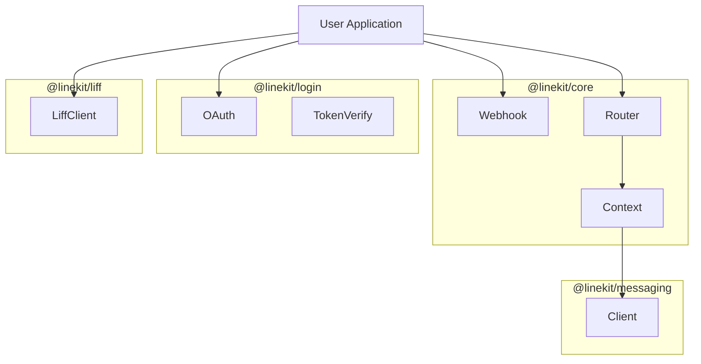

# Architecture

linekit follows a modular architecture to ensure separation of concerns and flexibility.

## Layers

### 1. Core Layer (`@linekit/core`)

- **Responsibility**: Foundation logic that is framework-agnostic.
- **Components**:
  - `Webhook`: Middleware for signature verification and body parsing.
  - `Router`: Dispatches normalized events to handlers.
  - `Context`: Wraps the raw LINE event and provides convenience methods (reply, push).
  - `Types`: Shared TypeScript definitions.

### 2. Messaging Layer (`@linekit/messaging`)

- **Responsibility**: Wrapper around LINE Messaging API.
- **Components**:
  - `Client`: `fetch`-based HTTP client.
  - `Methods`: `reply`, `push`, `multicast`, `richMenu`.
  - **Dependency**: Used by `Core` to implement `Context` methods.

### 3. Login Layer (`@linekit/login`)

- **Responsibility**: OIDC and OAuth flow.
- **Independent**: Can be used without Core/Messaging (e.g., for a login-only site).

### 4. Adapter Layer (`@linekit/adapters/*`)

- **Responsibility**: Glue code between `Core` and web frameworks.
- **Components**:
  - `@linekit/express`: Adapts Express `req`/`res` to Core's middleware signature.

### 5. LIFF Layer (`@linekit/liff`)

- **Responsibility**: LIFF management (Server-side) and types.
- **Components**:
  - `Client`: CRUD operations for LIFF Apps.
  - `Types`: Type definitions for LIFF View.

## Architecture Diagram

## Data Flow (Webhook)

1. **LINE Platform** sends POST request to your server.
2. **Adapter** (e.g. Express) receives request.
3. **Webhook Middleware** (`@linekit/core`) validates `X-Line-Signature`.
4. **Router** (`@linekit/core`) iterates over `events` array.
5. **Context** is created for each event.
6. **Handler** (User code) is executed with `ctx`.
7. **Response** (200 OK) is sent back to LINE.
